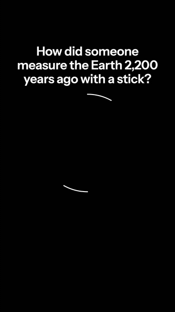
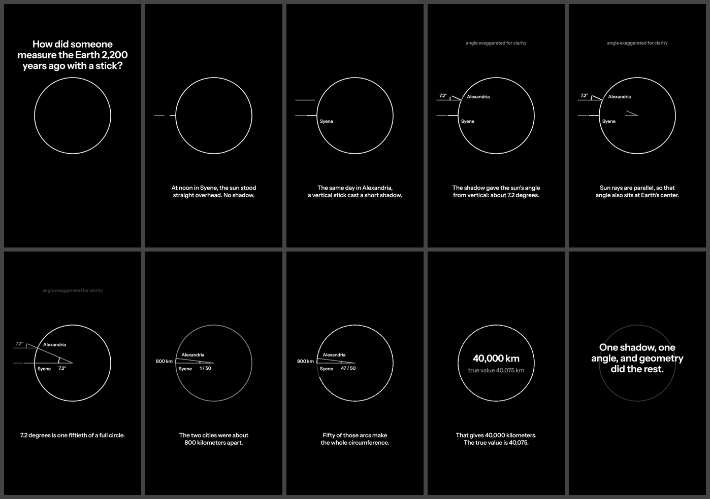

<div align="center">

# ig-explainer

**Type a topic. Get a finished explainer video.**

A builder-and-critic pipeline that runs inside [Claude Code](https://claude.com/claude-code): it writes the script,
narrates it locally, animates the diagram to the narration, then grades its own work and fixes what it finds.

[](LICENSE)
[](https://claude.com/claude-code)
[](https://remotion.dev)
[](https://github.com/hexgrad/kokoro)



*Silent preview. [Watch it with narration →](https://github.com/prabaljainn/ig-explainer/releases/latest)*

</div>

---

```
/explainer how a bicycle stays upright
```

That is the whole interface. A few minutes later you have a 1080×1920 MP4 with narration, captions timed to every
spoken line, a cover frame, and a post caption.

## Why this exists

Most AI video tools generate footage and hope it looks right. This one is built the way an explainer actually
works: **one idea per line, one diagram that transforms as the idea develops, and nothing on screen that the
narrator is not currently saying.**

The difference is the critic. When a render finishes, an independent agent with its own context samples the
frames, reads the script, and scores the result against a rubric with hard caps for clipped text, unsafe zones,
and any frame that contradicts the narration. Below 8.0 it returns a ranked fix list and the builder goes again.

Here is that loop on the example above, unedited:

| Round | Score | What the critic caught |
|:-----:|:-----:|------------------------|
| 1 | 5.7 | City labels sitting on the circle stroke; fifty 7.2° arcs shown against an exaggerated 24° arc; diagram 60 px off the text axis |
| 2 | 6.0 | Two scene handoffs where new text landed on text that had not finished fading |
| 3 | **8.6** | Nothing capped, nothing regressed |

No human touched the frames between those rounds.

## Quickstart

```bash
git clone https://github.com/prabaljainn/ig-explainer && cd ig-explainer
./install.sh
```

Restart Claude Code, then from **any** directory:

```
/explainer why the sky is blue
/explainer how Kubernetes restarts your pod manim
```

`install.sh` checks your prerequisites first, builds the Python environment, installs the render engine, and links
the skill and both critic agents into `~/.claude`. It ends with a readiness report that names the fix for anything
missing. A clean install takes about a minute once pip has PyTorch cached; the very first one downloads it, so
give it longer before assuming it has hung.

**Requirements:** macOS or Linux, `ffmpeg`, Node 20+, Python 3.10–3.12, and `espeak-ng`
(`brew install espeak-ng` / `sudo apt install espeak-ng`).

## What makes the output good

**Narration drives everything.** Each line is synthesized on its own, so captions and animation beats begin
exactly when the words do. Every sub-beat is expressed as a *fraction* of its line, never a hardcoded second, so
the same choreography survives translation into a language that takes longer to say the same thing. Change a line,
re-run the narration, and the timing follows.

**One diagram, transformed.** Objects persist and change across lines instead of cutting to a new layout. The
Earth drawn during the hook is the same circle that gets ghosted under the takeaway forty seconds later. That
continuity is how a viewer keeps the model in their head.

**A look that holds.** True black, white ink, one typeface, one stroke weight, at most two type sizes on screen,
and one optional accent colour per video. Every token lives in `brand/style.json`; nothing is hardcoded, so
restyling the whole catalogue is one file. Icons, where a diagram needs them, are [Lucide](https://lucide.dev)
line icons drawn at the same stroke weight as the diagram, never raster clip art.

**Private by default.** Narration runs locally on CPU via [Kokoro](https://github.com/hexgrad/kokoro) at roughly
three seconds per line. Nothing leaves your machine unless you opt into a hosted voice.

**Built for the phone it plays on.** Instagram's interface covers the top 260 px and bottom 340 px of a vertical
frame. The safe area is a token, the critic enforces it, and the contact sheet shows you what a viewer sees.

## How a video gets made



1. **Brief.** The one surprising idea, and the single hero diagram the whole video is built around.
2. **Engine.** Manim for geometry, angles, arcs and transformations; Remotion for typography, layout, timelines
   and charts. Whichever serves the hardest scene wins.
3. **Script.** Eight to fourteen lines. One idea each, twelve words or fewer. Line one is a hook that sounds
   wrong; the last line stands alone as the caption.
4. **Narration.** Per line, cached by content hash, with a timeline every scene reads.
5. **Scenes.** Written against that timeline, then rendered, muxed, and loudness-normalised for social.
6. **Self-check, then the critic.** The builder looks at a contact sheet first and fixes what it can see. The
   critic is for what it can no longer see.

A full 1080×1920 render of a forty-second video takes about 13 seconds, so iteration is cheap and the expensive
step is judgement, not pixels.

## Voice and languages

| | |
|---|---|
| **Default** | Kokoro, local, Apache 2.0, multiple English presets |
| **Your own voice** | [Chatterbox](https://github.com/resemble-ai/chatterbox) zero-shot cloning from a 15–20 s reference clip, with a second critic that scores naturalness, speaker similarity, pitch variability and pace |
| **Other languages** | Hindi, Japanese and 20 more, including Hinglish code-mixing where the caption and the spoken form differ per line |
| **Hosted** | Gemini TTS, optional, for expressive delivery |

**[Full voice and language reference →](docs/voice.md)** covers every flag, the `caption || spoken` per-line
syntax, per-phrase `[hi]`/`[en]` tags, recording a reference clip, and running the pipeline by hand.

Non-Latin scripts get their own typeface slice, and captions break at punctuation or word boundaries rather than
mid-compound. `videos/kubernetes-basics` ships in English, Japanese and Hinglish from one shared composition, so a
translation is a new script and a re-render, not a new video.

## Layout

```
CLAUDE.md                        the rulebook the builder follows
skills/explainer/                the skill that runs this pipeline from any directory
skills/explainer/reference/      what the critic docks points for; hard-won toolchain notes
.claude/agents/video-critic.md   the picture critic: own context, Bash + Read only, returns JSON
.claude/agents/voice-critic.md   the same gate for cloned narration
brand/style.json                 colours, type sizes, safe zones, fps: the only place they live
tools/                           narration, mux, frame sampling, scaffolding, preflight
docs/voice.md                    voices, languages, cloning, manual operation, troubleshooting
engine/remotion/                 compositions, auto-discovered from src/videos/<slug>/
engine/manim/                    IGScene base class and a template scene
videos/_example/                 the worked example above, brief and script included
```

## FAQ

**Does it work outside Instagram?** The output is standard 9:16 H.264, so Reels, Shorts and TikTok all take it
directly. The safe-area tokens are tuned for Instagram; change them in `brand/style.json`.

**Can I use my own brand?** Change `brand/style.json`. Colours, typeface, sizes and safe zones are read by both
engines, and no scene hardcodes them.

**Does it need a GPU?** No. Narration runs on CPU. Voice cloning is much faster with Apple silicon or CUDA.

**What if the critic never reaches 8.0?** After three rounds it delivers the best-scoring render and tells you
exactly which issues remain.

## Licensing

This repository is MIT. Manim is MIT, Kokoro is Apache 2.0, Chatterbox is MIT, Instrument Sans is OFL.

**Remotion is source-available, not open source.** It is free for individuals and small companies; larger
companies need a licence. Check [remotion.dev/license](https://remotion.dev/license) before publishing under a
company account. The Manim engine has no such restriction.

Voice recordings under `brand/voice/` are gitignored: a reference clip of someone's voice is personal data, not a
brand asset.

---

<div align="center">
<sub>Built with <a href="https://claude.com/claude-code">Claude Code</a>. The example above was written, animated, graded and fixed by the pipeline itself.</sub>
</div>
